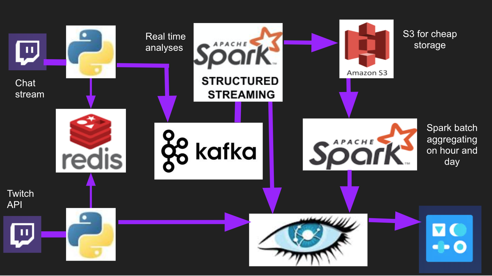

# TwitchTalk
## Motivation
[Fortnite May Have Caused 200 Divorces This Year Alone](https://www.esquire.com/lifestyle/sex/a23279319/fortnite-video-game-causing-divorces/)

I read this in the news and was intrigued by people mentioning Fortnight a popular video game
as one of the reasons for a divorce. I went to [twitch.tv](http://twitch.tv), a popular gaming broadcast site
to see what kind of data do they make available for analyses. There, I saw chat boxes that were hard to read 
and thought the channel owners would benefit from less spam.

I decided to get chat data from the most popular channels and find correlations between how popular the channel is 
(average viewership) vs how engaged the channel is (count of people that are currently chatting on a channel)

## Architecture

TwitchTalk runs a pipeline on the AWS cloud, using the following cluster configurations:

- 1 t2.micro EC2 instance Dash app
- 3 m4.large EC2 instances for Kafka producers
- 3 m4.large EC2 instances for Cassandra
- 4 m4.large EC2 instances for Spark Streaming
- 1 m4.large EC2 instance as a control machine runs
    - redis
    - hourly and daily spark batch jobs
    - Twitch IRC channel subscriber - daemon
    - Twitch Rest API consumer - cron for every minute

## Setup
- I used pegasus to install my clusters. You might want to use [the following](python/README.md)
to do the setup manually on your localhost to test this out. I will in due course try to setup 
docker images to run the complete pipeline
- You can run the [setup.py](python/src/setup.py) to create cassandra tables

## Comments?
Feel free to shoot me an email if anything here does not work for you!
